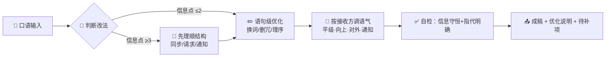

# formal-rewriter

**把话捋顺，不多一字，不少一事。**

把口语化、零碎、啰嗦的表达，优化成通顺、有条理、可直接发出去的书面化语言。只做表达层优化——换词、去口头禅、理语序、调语气；不注入任何项目、产品或背景信息，原意一字不丢。

 

---

## 🎬 它真正在干什么

"发一段话给别人"通常卡在三个地方：

> 脑子里是口语，打出来还是口语 → 一大段没重点对方看不下去 → 措辞不到位显得不专业或太生硬

这个 skill 只解决表达层的问题，不动你的信息：

> 口语输入 → 判断改法（顺句 or 重组）→ 表达优化（换词/删冗/理序/调语气）→ 自检 → 可发送的成稿

## ⚖️ 它和普通 AI 润色哪里不一样

| 普通 AI 润色 | formal-rewriter |
|---|---|
| 顺手添加你没说的细节、承诺、客套 | 信息守恒：原文有的都在，原文没有的一个不加 |
| 一律改写成"完美书面腔"，简单的话也套模板 | 简单内容只顺句子；零碎内容才整理结构 |
| 不区分发给谁，一个语气走天下 | 平级 / 向上 / 对外 / 通知四档，按接收方自动调 |
| 可能注入产品、项目背景把话说复杂 | 只优化表达，不注入任何业务背景 |
| 输出还要自己再删改 | 成稿直接粘贴进 IM 发送 |

一句话：润色工具帮你把话说漂亮，这个 skill 帮你把话说**准确、通顺、得体**。

## 🎥 一段话怎样被优化



## 🛠️ 六条表达优化手法

| 手法 | 做什么 | 例 |
|---|---|---|
| 换词 | 口语词 → 书面词 | 搞一下→处理；回头→稍后；啥→什么；挺→比较 |
| 删冗余 | 删口头禅和填充词 | 就是、然后（连用）、那个、的话、其实 |
| 理语序 | 结论/请求/主题先行，原因垫后 | "因为A所以B你看行不行" → "想请你确认B（原因：A）" |
| 拆长句 | 一句一个意思，并列事项排序 | 长串"，…然后…" → 短句或分点 |
| 明指代 | "他/这个/那个"换成明确对象 | 原文没说明白的用【】占位，不瞎补 |
| 调语气 | 请求用"麻烦/请"，不确定的留余地 | "目前看 / 预计"，不说过头话 |

**信息守恒**：优化前后对照，原文的每个事实、时间、数字、人名、诉求都必须在成稿里，且不新增。

## 🚀 第一次跑

直接丢一段话＋任一触发词：

```
书面化：就是那个事儿我这边弄的差不多了，回头我整理下剩下的发你，有啥问题你说话
帮我组织一下语言，怎么跟领导说下周三想请一天年假
把话说通顺点发给房东：厨房水龙头这两天一直滴水，周六上午我在家，找个人来看看
```

触发词：**书面化** / **帮我组织一下语言** / **改成能发给 XX 的** / **怎么跟 XX 说这件事** / **润色成消息** / **语法优化一下** / **把话捋顺**。

## ⚡ 日常用法

- 说清楚"发给谁"，语气档位会选得更准；不说就默认平级档
- 简单的一句话只做顺句，不会被强行套上编号模板
- 成稿里出现【占位项】，发出前先填上
- 每次输出带一行"优化说明"，告诉你改了哪里——方便你判断改动是否符合原意

## 📦 安装

```powershell
git clone https://github.com/guangquan123/formal-rewriter-skill.git
```

把仓库里的 `SKILL.md` 放入你所用 AI 助手的技能目录，目录名保持 `formal-rewriter`（常见位置：全局技能目录，或工作区内 `.opencode/skills/formal-rewriter`），重载技能列表后生效。

## 📂 仓库内容

```
formal-rewriter-skill/
├── README.md
├── LICENSE
└── SKILL.md        # 技能本体（定位、手法、流程、硬规则、示例）
```

## 🛡️ 硬规则

5 条不可违反：不编造 / 输入分档（缺料先要、不猜）/ 过滤情绪 / 敏感内容提醒 / 多事拆分。每条在 SKILL.md 中带"为什么设立＋生效判据"。

## 🧭 边界（不做什么）

| 需求 | 去哪 |
|---|---|
| 写可发布的公众号文章 / 短视频口播稿 | content-write |
| 已成稿去 AI 味 | humanizer-zh |
| 只调排版不改内容 | content-layout |

## 📜 License

[MIT](LICENSE)
